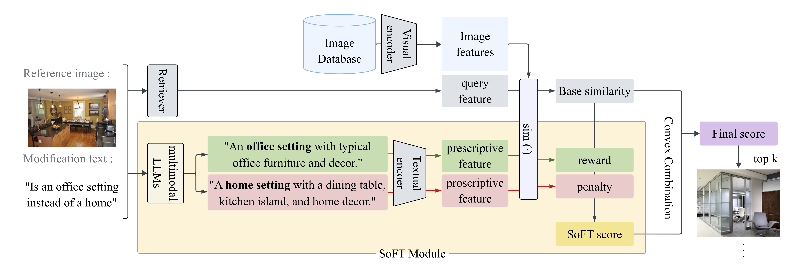

# SoFT 

This is the official repository of the [AAAI 2026 Workshop paper](https://arxiv.org/abs/2512.20781) **"Soft Filtering: Guiding Zero-shot Composed Image Retrieval with Prescriptive and Proscriptive Constraints"**.

## SoFT module

<p align="center">
  
</p>

> Figure 1: Overview of SoFT, a plug-and-play soft filtering module for Zero-shot CIR. Given a reference image and a modification text, multimodal LLMs extract prescriptive and proscriptive constraints. These are used to softly reward or penalize candidate images using CLIP similarity.

## Getting Start

### Download Datasets
Place each dataset inside the repository root under datasets/ exactly as shown below.

- [CIRCO Official Repository](https://github.com/miccunifi/CIRCO)
- [CIRR Official Repository](https://github.com/Cuberick-Orion/CIRR)
- [FashionIQ Official Repository](https://github.com/XiaoxiaoGuo/fashion-iq)

```
datasets
├── CIRCO
│   ├── annotations
|   |   ├── [val | test].json
│   ├── COCO2017_unlabeled
|   |   ├── annotations
|   |   |   ├──  image_info_unlabeled2017.json
|   |   ├── unlabeled2017
|   |   |   ├── [000000243611.jpg | 000000535009.jpg | ...]
│
├── CIRR
│   ├── cirr
│   ├── dev
|   |   ├── [dev-1-0-img1.png | dev-1-3-img1.png | ...]
│   ├── test1
|   |   ├── [test1-0-0-img0.png | test1-0-1-img1.png | ...]
│   ├── train
|   |   ├── [0 | 1 | 2 | 3 | ...]
│
├── FASHIONIQ
│   ├── captions
|   |   ├── [cap.dress.test.json | cap.dress.train.json | ...]
│   ├── image_splits
|   |   ├── [split.dress.test.json | split.dress.train.json | ...]
│   ├── images
|   |   ├── [245600258X.png | 978980539X.png | ...]
```

### Set Environments
```
conda create -n soft -y python=3.8
conda activate soft

pip install torch==1.11.0 torchvision==0.12.0 transformers==4.24.0 tqdm pandas==1.4.2 openai==1.79.0 open_clip_torch dotenv
pip install git+https://github.com/openai/CLIP.git
```

### Construct Multi-Target Triplets
Please see [README file](https://github.com/jjungyujin/SoFT/blob/main/MultiTarget_README.md).

### Run the CIR Model with SoFT
We use [CIReVL](https://github.com/ExplainableML/Vision_by_Language) as the representative baseline, and SoFT can be applied to any CIR model.  
See the example code below for reference.

```bash
# Please ensure your current working directory is set to SoFT.
mkdir baseline
cd baseline
git clone https://github.com/ExplainableML/Vision_by_Language.git
```

Load and apply the SoFT module as shown below. The complete code is available in [the file](https://github.com/jjungyujin/SoFT/tree/main/baseline/cirevl_with_soft.py).
```python
import sys
from pathlib import Path

# Adds the base directory of this repository to the path for importing modules.
base_dir = Path(__file__).resolve().parent.parent.parent
sys.path.append(str(base_dir))

from src.main import get_dual_constraints, get_constraint_scores
import src.compute_results as soft_compute_results


def main():
    # Add the following arguments required for SoFT:
    parser.add_argument(
        "--soft-preload-dir",
        type=str,
        default=f"{base_dir}/preload",
        help="Directory for soft constraint preloading.",
    )
    parser.add_argument(
        "--soft-openai-model",
        type=str,
        default="gpt-3.5-turbo",
        choices=["gpt-3.5-turbo", "gpt-4"],
        help="OpenAI model for soft constraints.",
    )
    parser.add_argument(
        "--rerank_type",
        type=str,
        default="soft",
        choices=["soft", "reward", "penalty"],
        help="Type of reranking for soft constraints.",
    )
    parser.add_argument(
        "--soft_lambda",
        type=float,
        default=1.0,
        help="Lambda value (0~1) for soft constraint weighting.",
    )

    #...
    if "fashioniq" in args.dataset.lower():
        # Instead of using the original compute_results, 
        # import the function from soft_compute_results to apply SoFT.
        compute_results_function = soft_compute_results.fiq

    #...

    out_dict = utils.generate_predictions(**input_kwargs)
    input_kwargs.update(out_dict)
    
    # After obtaining the results from the baseline model, 
    # constraints are generated and scores are calculated for applying SoFT.
    all_queries = get_dual_constraints(
        args.soft_preload_dir,
        args.dataset,
        query_dataset,
        input_kwargs["instructions"],
        input_kwargs["reference_names"],
        index_features,
        device,
        clip_model,
        args.soft_openai_model,
    )
    constraint_scores = get_constraint_scores(
        all_queries, index_features, device, clip_model, tokenizer
    )
    soft_dict = {
        "is_save_cache": False,
        "is_save_result": True,
        "baseline": "cirevl",
        "lambda_val": args.soft_lambda,
        "rerank_type": args.rerank_type,
        "target_type": (
            "multi" if "mt" in input_kwargs["args"].dataset.lower() else "single"
        ),
        **constraint_scores,
    }
    
    # Calculate the final results together with the scores from the SoFT module.
    input_kwargs.update(soft_dict)
    result_metrics = compute_results_function(**input_kwargs)
    #...
```